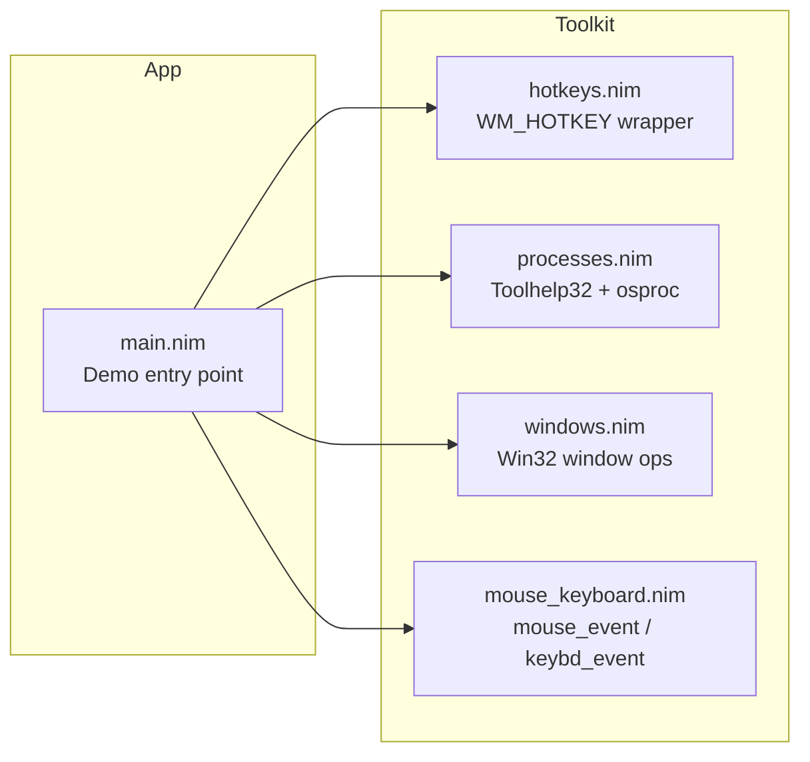

# ⚡ Nim AHK Toolkit – AutoHotkey-style Windows automation in Nim

> ⌨️ Global hotkeys • 🪟 Window control • 🧠 Process management • 🖱️ Mouse & keyboard simulation  

This project is a small, focused **Nim library + demo app** that gives you
AutoHotkey-style powers using **pure Nim + WinAPI**:

- Register **global hotkeys** with Nim callbacks
- Start / enumerate / kill **processes**
- Query and manipulate **windows** (titles, positions, centering)
- Drive **mouse & keyboard** input (move, click, send text)

---

## 🧭 High-Level Design & Future Direction

### Overall Design

The repo is structured as a tiny, composable toolkit:

```text
src/
  hotkeys.nim        # global hotkey registration + message loop
  processes.nim      # process enumeration, kill/start helpers
  windows.nim        # window handles, titles, geometry, centering
  mouse_keyboard.nim # mouse movement, clicks, key presses, text send
  main.nim           # demo harness wiring everything together
````

* `hotkeys.nim` wraps `RegisterHotKey` and the Windows message loop so you can
  map `Ctrl+Alt+X` → `proc()` in a few lines.
* `processes.nim` uses ToolHelp32 snapshots to enumerate and control processes.
* `windows.nim` uses classic Win32 window APIs (`GetForegroundWindow`, `GetWindowText`,
  `GetWindowRect`, `MoveWindow`, …) to inspect and manipulate windows.
* `mouse_keyboard.nim` wraps `mouse_event` / `keybd_event` for simple automation
  (mouse moves, clicks, and text entry).

`main.nim` is a **single-file demo** that shows how to wire it all together with a
handful of “AHK-like” hotkeys.

### Future Goals & Ideas 💡

Some possible next steps (for yourself or future contributors):

* 🧩 **Config-driven hotkeys**
  Load keybindings from a TOML/JSON/YAML file instead of hard-coding in `main.nim`.

* 🧱 **Mini “AHK” DSL in Nim**
  Something like:

  ```nim
  bind "Ctrl+Alt+R":
    run "notepad.exe"

  bind "Ctrl+Alt+1":
    centerActiveWindow()
  ```

* 🔍 **Window search utilities**

  * Find windows by “title contains / regex”
  * Bring window to front by title / process name

* 🖱️ **Richer mouse & keyboard support**

  * Scroll wheel
  * Middle button
  * Proper Unicode text input via `SendInput`

* 🧪 **Test harness / examples**

  * Separate example programs for each module (`examples/hotkeys_demo.nim`, etc.)

---

## 📦 Features at a Glance

* ✅ Windows-only (Win10/11, 64-bit)
* ✅ Nim 2.x
* ✅ Uses [winim](https://github.com/khchen/winim) for Win32 bindings
* ✅ No runtime dependencies beyond WinAPI

| Module               | What it does                                                         |
| -------------------- | -------------------------------------------------------------------- |
| `hotkeys.nim`        | Register/unregister global hotkeys, run a WM_HOTKEY message loop     |
| `processes.nim`      | Enumerate processes, find by name, kill by PID/name, start processes |
| `windows.nim`        | Foreground window, window titles, geometry, centering, simple search |
| `mouse_keyboard.nim` | Mouse position, clicks, keyboard presses, simple ASCII text send     |
| `main.nim`           | Example executable using all of the above with easy demo hotkeys     |

---

## 🧱 Architecture (Big Picture)



---

## 🚀 Getting Started

### Prerequisites

* 🪟 **Windows 10/11**
* 🦊 **Nim 2.x** installed
* 📚 `winim` package:

```bash
nimble install winim
```

### Clone & Build

From the repo root:

```bash
cd src
nim c -d:release main.nim
# or to run immediately:
nim c -r -d:release main.nim
```

You should see something like:

```text
Nim AHK-like demo started.
Hotkeys (if registration succeeds):
  ESC             : exit program
  Ctrl+Alt+A      : start Notepad
  Ctrl+Alt+Q      : kill all notepad.exe processes
  Ctrl+Alt+W      : center the active window
  Ctrl+Alt+E      : print active window info
  Ctrl+Alt+M      : move mouse to screen center
  Ctrl+Alt+L      : left-click at current mouse position
  Ctrl+Alt+T      : type "Hello from Nim!"
```

---

## 🎮 Demo Hotkeys (`main.nim`)

Once the demo is running:

* ⛔ `ESC`
  Kill-switch. Exits the program by posting `WM_QUIT`.

* 📝 `Ctrl+Alt+A`
  Start `notepad.exe` using `startProcessDetached`.

* 💥 `Ctrl+Alt+Q`
  Kill *all* `notepad.exe` processes via `killProcessesByName`.

* 🪟 `Ctrl+Alt+W`
  Center the **currently active** window on your primary monitor.

* 🔍 `Ctrl+Alt+E`
  Print active window info (handle, title, geometry) to the console.

* 🎯 `Ctrl+Alt+M`
  Move the mouse cursor to the center of the primary monitor using `setMousePos`.

* 🖱️ `Ctrl+Alt+L`
  Left-click at the current mouse position.

* 💬 `Ctrl+Alt+T`
  Send the text `"Hello from Nim!"` to the active window (ASCII-only).

---

## 🔧 Module Reference & Examples

### 1. `hotkeys.nim` – Global Hotkeys

Registering a global hotkey is a one-liner:

```nim
import hotkeys
import winim/lean        # for MOD_* constants
import mouse_keyboard    # for KEY_* constants

discard registerHotkey(
  MOD_CONTROL or MOD_ALT,
  KEY_R,
  proc() =
    echo "Ctrl+Alt+R pressed!"
)
```

Start the message loop (this blocks until `postQuit()` is called):

```nim
runMessageLoop()
```

And exit from a callback:

```nim
discard registerHotkey(0, KEY_ESCAPE, proc() =
  echo "ESC pressed, exiting..."
  postQuit()
)
```

**Design notes:**

* Internally uses `RegisterHotKey` and a classic `GetMessage` loop.
* Keeps a `Table[HotkeyId, HotkeyCallback]` of registered hotkeys.
* Throws `IOError` if the hotkey is already in use by another program.

---

### 2. `processes.nim` – Process Utilities

Enumerate all running processes:

```nim
import processes

for p in enumProcesses():
  echo p.pid, " -> ", p.exeName
```

Find processes by executable name (case-insensitive):

```nim
let notepads = findProcessesByName("notepad.exe")
echo "Found ", notepads.len, " Notepad process(es)."
```

Kill processes by name:

```nim
let killed = killProcessesByName("notepad.exe")
echo "Killed ", killed, " Notepad process(es)."
```

Start a process "detached":

```nim
if startProcessDetached("notepad.exe"):
  echo "Started Notepad!"
```

**Under the hood:**

* Uses `CreateToolhelp32Snapshot`, `Process32First`, `Process32Next`.
* Wraps `OpenProcess(PROCESS_TERMINATE)` + `TerminateProcess` to kill by PID.
* Uses Nim’s `osproc.startProcess` for launching (`poUsePath`, `poDaemon`).

---

### 3. `windows.nim` – Window Management

Get the active window and its title:

```nim
import ./windows as win

let hwnd = win.getActiveWindow()
echo "Active title: ", win.getWindowTitle(hwnd)
```

Center the window on the primary monitor:

```nim
if win.centerWindowOnPrimaryMonitor(hwnd):
  echo "Centered window!"
```

Print a human-friendly description:

```nim
echo win.describeWindow(hwnd)
# e.g. HWND=0x123456, title="Untitled - Notepad", x=100, y=100, w=800, h=600
```

Find by exact title:

```nim
let h = win.findWindowByTitleExact("Untitled - Notepad")
if h != 0:
  discard win.bringToFront(h)
```

---

### 4. `mouse_keyboard.nim` – Mouse & Keyboard Helpers

Get and set mouse position:

```nim
import mouse_keyboard

let pos = getMousePos()
echo "Mouse at (", pos.x, ", ", pos.y, ")."

discard setMousePos(500, 500)
```

Clicking:

```nim
leftClick()             # at current position
rightClick()

leftClickAt(800, 400)   # move + click
```

Key presses:

```nim
sendKeyPress(KEY_ENTER)           # simple Enter
sendKeyPress(KEY_F5)              # refresh (e.g. browser)
keyDown(KEY_SHIFT)
sendKeyPress(KEY_A)
keyUp(KEY_SHIFT)
```

Simple ASCII text sending:

```nim
sendText("Hello from Nim!\n123")
```

> ⚠️ `sendText` is intentionally simple: ASCII only, US keyboard assumptions,
> and uses `keybd_event` under the hood. Good enough for many automation
> scenarios, but not a full IME/Unicode solution.

---

## 🧪 Example: Building Your Own Automation Script

Here’s a minimal custom script that:

* Uses **Esc** to exit
* Uses **Ctrl+Alt+1** to center the active window
* Uses **Ctrl+Alt+2** to type “Nim is cool!”

```nim
import winim/lean
import hotkeys
import ./windows as win
import mouse_keyboard

const CTRL_ALT = MOD_CONTROL or MOD_ALT

when isMainModule:
  # ESC exit
  discard registerHotkey(0, KEY_ESCAPE, proc() =
    echo "Bye!"
    postQuit()
  )

  # Ctrl+Alt+1 – center active window
  discard registerHotkey(CTRL_ALT, KEY_1, proc() =
    let hwnd = win.getActiveWindow()
    if win.centerWindowOnPrimaryMonitor(hwnd):
      echo "Centered active window."
    else:
      echo "Failed to center window."
  )

  # Ctrl+Alt+2 – send text
  discard registerHotkey(CTRL_ALT, KEY_2, proc() =
    sendText("Nim is cool!\n")
  )

  echo "Hotkeys ready. Press ESC to exit."
  runMessageLoop()
```

Compile & run:

```bash
nim c -r -d:release your_script.nim
```

---

## ⚠️ Caveats & Safety

* 🔐 **Global hotkeys can conflict**
  If a hotkey is already used by another program, `registerHotkey` will raise
  an `IOError`. The demos already wrap registrations in `try/except` and log
  failures.

* 💾 **Killing processes is destructive**
  `killProcessesByName` uses `TerminateProcess`, just like `Task Manager → End Task`.
  Unsaved work may be lost.

* 🌐 **Windows only**
  The code uses Win32 APIs directly. There is no cross-platform fallback.

* ⌨️ **Keyboard layout assumptions**
  `sendText` currently assumes a US-style layout and ASCII characters.

---

## 🤝 Contributing

Ideas / PRs that would be especially welcome:

* Config-driven hotkey definitions
* Better `sendText` (Unicode, non-US layouts)
* More window search helpers (by class, partial title, PID)
* Example scripts for common workflows (window tiling, app launchers, etc.)

Feel free to fork, experiment, and turn this into your own Nim-based automation
toolkit.

---

## 📜 License
This project is licensed under the MIT License.
See the LICENSE
 file for full details.

---
