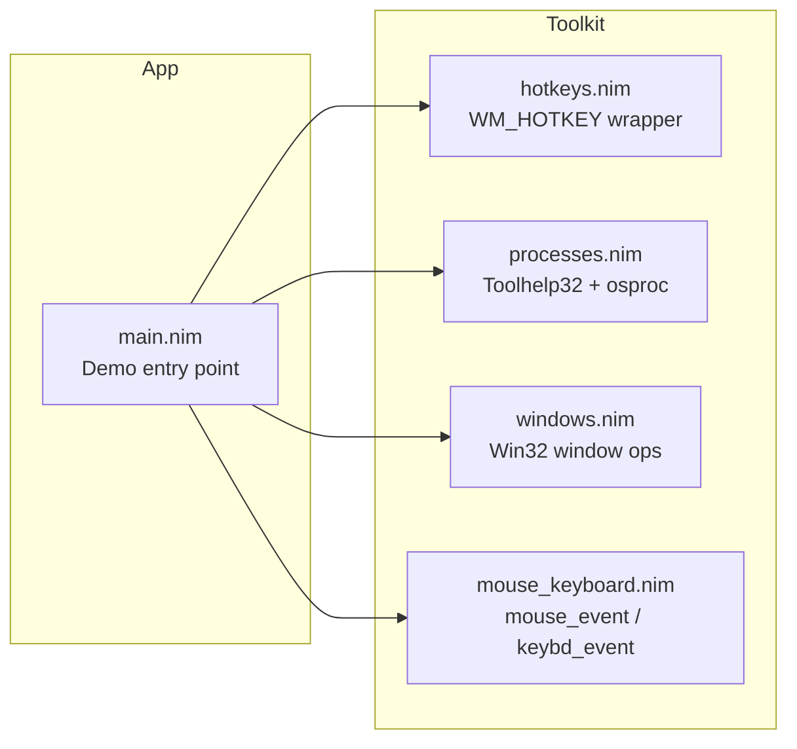

# Nim AHK Toolkit – How-to & Reference

Deep-dive documentation for architecture, module APIs, examples, and performance notes. For a quick onboarding experience, start with the [README](README.md).

## High-level design & future direction

### Overall design
The repo is structured as a tiny, composable toolkit:

```text
src/
  hotkeys.nim        # global hotkey registration + message loop
  processes.nim      # process enumeration, kill/start helpers
  win/               # cross-platform window facade (WinAPI backend)
  input/             # SendInput-powered mouse/keyboard helpers
  windows.nim        # window handles, titles, geometry, centering (legacy)
  mouse_keyboard.nim # mouse movement, clicks, key presses, text send (legacy)
  main.nim           # demo harness wiring everything together
````

* `hotkeys.nim` wraps `RegisterHotKey` and the Windows message loop so you can map `Ctrl+Alt+X` → `proc()` in a few lines.
* `processes.nim` uses ToolHelp32 snapshots to enumerate and control processes.
* `win/` exposes window discovery, activation, movement, and enumeration. On non-Windows targets it provides feature detection and clear errors.
* `input/` wraps `SendInput` for mouse/keyboard automation with configurable delays and absolute/relative coordinates.
* `windows.nim` and `mouse_keyboard.nim` remain as thin, legacy wrappers to keep older code compiling.

`main.nim` is a **single-file demo** that shows how to wire it all together with a handful of “AHK-like” hotkeys.

### Future goals & ideas 💡
* 🧩 **Config-driven hotkeys** – Load keybindings from a TOML/JSON/YAML file instead of hard-coding in `main.nim`.
* 🧱 **Mini “AHK” DSL in Nim** with bindings like:
  ```nim
  bind "Ctrl+Alt+R":
    run "notepad.exe"

  bind "Ctrl+Alt+1":
    centerActiveWindow()
  ```
* 🔍 **Window search utilities** – title contains/regex, bring to front by title/process name.
* 🖱️ **Richer mouse & keyboard support** – scroll wheel, middle button, Unicode text via `SendInput`.
* 🧪 **Test harness / examples** – dedicated example programs per module (e.g., `examples/hotkeys_demo.nim`).

## Architecture (big picture)


## Prerequisites & setup

### Core requirements
* 🪟 **Windows 10/11**
* 🦊 **Nim 2.x** installed
* 📚 `winim` package:

```bash
nimble install winim
```

### UI Automation (UIA) prerequisites
* ✅ `UIAutomationCore.dll` (ships with Windows)
* ✅ COM apartment initialized (`initUia` defaults to `COINIT_APARTMENTTHREADED`)
* ⚠️ If your app already called `CoInitializeEx` with a different apartment model, `initUia` will surface `RPC_E_CHANGED_MODE` so you can adjust.

## Building & running
From the repo root:

```bash
cd src
nim c -d:release main.nim
# or to run immediately:
nim c -r -d:release main.nim

# UI Automation tree demo (Windows only):
nim c -r -d:release main.nim --uia-demo
```

## Demo hotkeys (detailed)
* ⛔ `ESC` – Kill-switch; exits the program by posting `WM_QUIT`.
* 📝 `Ctrl+Alt+A` – Start `notepad.exe` using `startProcessDetached`.
* 💥 `Ctrl+Alt+Q` – Kill *all* `notepad.exe` processes via `killProcessesByName`.
* 🪟 `Ctrl+Alt+W` – Center the **currently active** window on your primary monitor.
* 🔍 `Ctrl+Alt+E` – Print active window info (handle, title, geometry) to the console.
* 🎯 `Ctrl+Alt+M` – Move the mouse cursor to the center of the primary monitor using `setMousePos`.
* 🖱️ `Ctrl+Alt+L` – Left-click at the current mouse position.
* 💬 `Ctrl+Alt+T` – Send the text `"Hello from Nim!"` to the active window (ASCII-only).

## Autohotkey-style helpers
The new `win/` and `input/` layers aim to mirror common AutoHotkey v2 recipes:

```nim
import win/win
import input/input
import ahk_dsl

# Focus a window by exact title and type into it.
var notepad = withWindow("Untitled - Notepad")
notepad.typeText("Hello from Nim!\n")

# Wait up to 5s for a window, then send Ctrl+S.
if let some(w) = winWait("Untitled - Notepad", 5.seconds):
  var sess = w
  sess.sendKeys([VK_CONTROL, 'S'.ord])

# Timed mouse move and click at absolute screen coordinates.
moveMouse(MousePoint(x: 300, y: 400), relative = false)
clickMouse(button = "left")

# Drag with interpolation.
dragMouse(MousePoint(x: 100, y: 100), MousePoint(x: 200, y: 250), steps = 5)
```

All helpers perform feature detection: on non-Windows platforms they short-circuit with clear error messages so you know which APIs are unavailable.

## Module reference & examples
### `hotkeys.nim` – Global hotkeys
Registering a global hotkey is a one-liner:

```nim
import hotkeys
import winim/lean        # for MOD_* constants
import mouse_keyboard    # for KEY_* constants

discard registerHotkey(
  MOD_CONTROL or MOD_ALT,
  KEY_R,
  proc() =
    echo "Ctrl+Alt+R pressed!",
)
```

Start the message loop (blocks until `postQuit()` is called):

```nim
runMessageLoop()
```

Exit from a callback:

```nim
discard registerHotkey(0, KEY_ESCAPE, proc() =
  echo "ESC pressed, exiting..."
  postQuit()
)
```

Design notes:
* Uses `RegisterHotKey` and a `GetMessage` loop.
* Keeps a `Table[HotkeyId, HotkeyCallback]` of registered hotkeys.
* Throws `IOError` if the hotkey is already in use by another program.

### `processes.nim` – Process utilities
Enumerate all running processes:

```nim
import processes

for p in enumProcesses():
  echo p.pid, " -> ", p.exeName
```

Find processes by executable name (case-insensitive):

```nim
let notepads = findProcessesByName("notepad.exe")
echo "Found ", notepads.len, " Notepad process(es)."
```

Kill processes by name:

```nim
let killed = killProcessesByName("notepad.exe")
echo "Killed ", killed, " Notepad process(es)."
```

Start a process "detached":

```nim
if startProcessDetached("notepad.exe"):
  echo "Started Notepad!"
```

Under the hood:
* Uses `CreateToolhelp32Snapshot`, `Process32First`, `Process32Next`.
* Wraps `OpenProcess(PROCESS_TERMINATE)` + `TerminateProcess` to kill by PID.
* Uses Nim’s `osproc.startProcess` for launching (`poUsePath`, `poDaemon`).

### `windows.nim` – Window management
Get the active window and its title:

```nim
import ./windows as win

let hwnd = win.getActiveWindow()
echo "Active title: ", win.getWindowTitle(hwnd)
```

Center the window on the primary monitor:

```nim
if win.centerWindowOnPrimaryMonitor(hwnd):
  echo "Centered window!"
```

Print a human-friendly description:

```nim
echo win.describeWindow(hwnd)
# e.g. HWND=0x123456, title="Untitled - Notepad", x=100, y=100, w=800, h=600
```

Find by exact title:

```nim
let h = win.findWindowByTitleExact("Untitled - Notepad")
if h != 0:
  discard win.bringToFront(h)
```

### `mouse_keyboard.nim` – Mouse & keyboard helpers
Get and set mouse position:

```nim
import mouse_keyboard

let pos = getMousePos()
echo "Mouse at (", pos.x, ", ", pos.y, ")."

discard setMousePos(500, 500)
```

Clicking:

```nim
leftClick()             # at current position
rightClick()

leftClickAt(800, 400)   # move + click
```

Key presses:

```nim
sendKeyPress(KEY_ENTER)           # simple Enter
sendKeyPress(KEY_F5)              # refresh (e.g. browser)
keyDown(KEY_SHIFT)
sendKeyPress(KEY_A)
keyUp(KEY_SHIFT)
```

Simple ASCII text sending:

```nim
sendText("Hello from Nim!\n123")
```

> ⚠️ `sendText` is intentionally simple: ASCII only, US keyboard assumptions, and uses `keybd_event` under the hood. Good enough for many automation scenarios, but not a full IME/Unicode solution.

### `uia.nim` – UI Automation
Wraps Windows UIA COM interfaces with helper methods that mirror the excellent [UIA-v2](https://github.com/Descolada/UIA-v2) ergonomics:

```nim
import std/times
import uia

when defined(windows):
  let automation = initUia() # initializes COM (STA by default)
  defer: automation.shutdown()

  # Find a button by name and click it.
  let okButton = automation.waitElement(tsDescendants, automation.nameAndControlType("OK", UIA_ButtonControlTypeId), 3.seconds)
  if okButton != nil:
    okButton.invoke()

  # Target a control by AutomationId and type into it.
  let searchBox = automation.findFirstByAutomationId("SearchEdit", tsDescendants)
  if searchBox != nil:
    searchBox.setValue("Hello from Nim")

  # Hit-test at a point and toggle if supported.
  let element = automation.fromPoint(0, 0)
  if element != nil and element.hasPattern(UIA_TogglePatternId, "Toggle"):
    element.toggle()
else:
  echo "UI Automation only works on Windows."
```

Troubleshooting tips:
* 🧩 **Apartment model**: UIA requires an initialized COM apartment. `initUia` defaults to `COINIT_APARTMENTTHREADED`. If you already initialized COM differently you may see `RPC_E_CHANGED_MODE`; re-run `initUia` with the same coinit flag you use elsewhere.
* 🔍 **Pattern availability**: calls like `invoke()` and `setValue()` raise `UiaError` with the HRESULT if the pattern is missing. Use `hasPattern(element, UIA_InvokePatternId, "Invoke")` before invoking to branch gracefully.
* 🪟 **UIAutomationCore**: ships with Windows. If you receive load errors, ensure your process is 64-bit on 64-bit Windows and that accessibility is enabled for the target app.

Manual UIA hotkey verification (Windows-only):
1. Build and run the demo with the default config:
   ```bash
   nim c -r -d:release src/main.nim
   ```
2. Launch Notepad (or use the bundled "Launch Notepad" hotkey) and move its window into view.
3. Hit `Ctrl+Alt+U` to trigger the `invoke` action. The config targets Notepad's "Save" button (AutomationId `Save`, control type `Button`); the console log should show "Invoked UIA element" with control type/name/AutomationId fields.
4. Move your mouse over any UI element and press `Ctrl+Alt+I` to run `uia_dump_element`. The logger prints the control type, name, AutomationId, and native HWND for the element under the cursor or matching the optional filters.

## Binding window targets at runtime
You can bind the **currently active window** to a named target without editing the config file:

```toml
[[hotkeys]]
name = "Bind Active Window to Notepad"
keys = "Ctrl+Alt+B"
action = "capture_window_target"
params.target = "notepad"
params.persist = "true"  # optional; writes to window_targets_state.toml
```

When triggered, `capture_window_target` reads the HWND returned by `getActiveWindow()`, updates the in-memory `windowTargets` map, and (if `persist` is true) writes it to a state file located next to your config. On startup the state file is validated and merged back into the target map so your bindings survive restarts while skipping any invalid handles.

## Performance, latency, and benchmarks
### Microbenchmarks for hot paths
Run the built-in microbenchmarks to validate the cost of key Windows calls (SendInput dispatch, window enumeration, and UIA queries):

```bash
nim c -r -d:release tests/bench_hotpaths.nim
```

This prints average microseconds per call so you can track regressions over time. Use `-d:release` to avoid debug overhead and capture realistic timings.

### Expected timings and best practices
* **Input dispatch latency**: With `InputDelays(betweenEvents: 0.milliseconds, betweenChars: 0.milliseconds)` the SendInput path should complete in the sub-millisecond range on modern Windows 10/11 hardware. Use non-zero delays only when you intentionally want to slow down automation for target apps.
* **Window polling**: To avoid pegging the CPU when waiting for windows to appear, the `winWait` helper accepts `WindowPollingOptions` (poll interval + debounce). For background loops, start with `pollInterval = 150.milliseconds` and `debounce = 25.milliseconds` to cap polling frequency while still feeling responsive.
* **UI Automation queries**: Reuse a single `Uia` instance across operations to keep COM initialization and root lookups cached. The benchmarks above exercise `rootElement()` repeatedly to expose the cost of UIA round-trips.

These measurements help you catch unexpected allocation spikes or FFI overhead. If you see numbers jump, profile with `nim c -d:release --passC:"-pg"` or a Win32 profiler and look for accidental allocations in tight loops.

## Caveats & safety
* 🔐 **Global hotkeys can conflict** – `registerHotkey` raises `IOError` if the hotkey is already in use.
* 💾 **Killing processes is destructive** – `killProcessesByName` uses `TerminateProcess`, just like Task Manager → End Task.
* 🌐 **Windows only** – The code uses Win32 APIs directly; there is no cross-platform fallback.
* ⌨️ **Keyboard layout assumptions** – `sendText` assumes a US-style layout and ASCII characters.

## Contributing
Ideas / PRs that would be especially welcome:
* Config-driven hotkey definitions
* Better `sendText` (Unicode, non-US layouts)
* More window search helpers (by class, partial title, PID)
* Example scripts for common workflows (window tiling, app launchers, etc.)

Feel free to fork, experiment, and turn this into your own Nim-based automation toolkit.

## License
This project is licensed under the MIT License. See [LICENSE](LICENSE) for full details.
